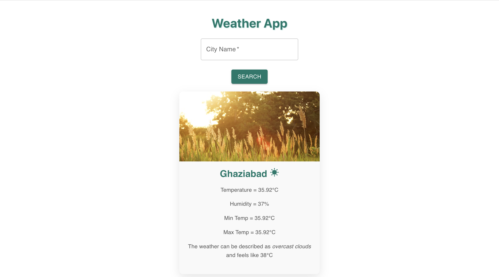

# 🌤️ Weather App

A responsive weather application built with **React**, **Vite**, and **Material UI**, powered by the **OpenWeatherMap API**. Users can search for any city and view real-time weather conditions like temperature, humidity, and description — presented with a dynamic UI.

---

## 📸 Screenshot



---

## ✨ Features

- 🔍 City-based weather search
- 🌡️ Real-time temperature, humidity, min/max values
- 🎭 Weather description with icon & dynamic background
- 🎨 Beautiful UI using Material UI and custom styles
- 🚫 Error message for invalid city searches

---

## 🛠️ Tech Stack

- **Frontend**: React + Vite
- **UI**: Material UI (MUI)
- **API**: OpenWeatherMap
- **Styling**: CSS Modules

---

## ⚙️ Setup Instructions

```bash
# 1. Clone the repo
git clone https://github.com/GunSinghal/weather-app.git

# 2. Navigate to the project directory
cd weather-app

# 3. Install dependencies
npm install

# 4. Run the development server
npm run dev

```
